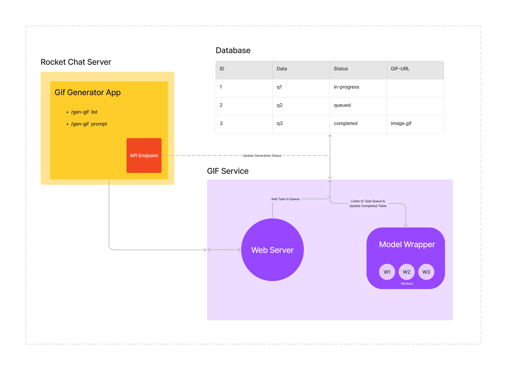

## Model Wrapper Demo

This repository acts as a POC to display how Model Wrapper would be implemented. It involved, running multiple workers and constantly listening to DB changes. A simple yet effective solution has been provided in this repository.

### Tasks of Model Wrapper:

- [x] It consists of several workers which are nothing but parallel processes/threads that perform multiple generations parallelly.
- [x] Constantly listen to DB changes using ChangeStream, and assign tasks to workers in case any worker is empty. (`ChangeStream` requires replica-set in mongodb)
- [x] Maintain complete worker lifecycle, and store in DB.
- [x] If a worker gets free, it picks up the next task and continues working until there are no tasks labeled as queued. Though it currently depends upon **polling**, can be easily achieved.

> Model Wrapper is shown encoded in purple color